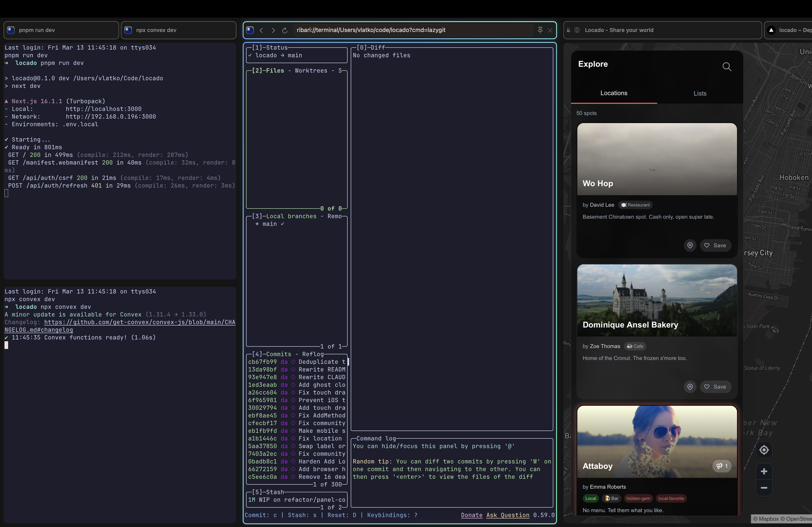

<p align="center">
  
</p>

<h1 align="center">Ribari</h1>

<p align="center">
  A native macOS tiling browser for power users.
</p>

<p align="center">
  
</p>

---

## What is Ribari?

Ribari brings [niri](https://github.com/YaLTeR/niri)'s scrolling tiling paradigm to the browser. Tabs become tiles on an infinite horizontal strip — spatial navigation first, with a sidebar and tab bar when you want them. Columns sit side by side, tiles stack vertically, and workspaces give you isolated contexts you can swipe between.

Window management on macOS is pretty restrictive, and even the best tiling tools run into walls the OS puts up. Ribari takes a different path — it puts the tiling inside the app. Your browser tabs, [ghostty](https://ghostty.org) terminals, and code editors (VS Code, Cursor, T3 Code) all tile together on an infinite scrolling workspace, giving you something closer to niri without fighting macOS for control.

## Features

- **Scrolling tiling layout** — tabs are tiles in an infinite horizontal strip (niri paradigm)
- **Columns & splits** — vertical and horizontal splits, configurable column widths (1/3, 1/2, 2/3, full)
- **Multiple workspaces** — separate browsing contexts, switch with gestures or shortcuts
- **Incognito workspaces** — isolated private browsing per workspace
- **Keyboard-first** — Ctrl as tiling modifier (niri-style), Cmd for browser actions
- **Command palette** — fuzzy search across tabs, history, URLs, and workspaces (Cmd+K)
- **Integrated terminal** — GPU-accelerated [ghostty](https://ghostty.org) terminal tiles, side by side with web tiles
- **Code editors** — VS Code, Cursor, and T3 Code tile alongside browser and terminal tabs
- **Content blocking** — built-in ad and tracker filtering (light / balanced / strict)
- **Extensions** — JS-based extension system for customization
- **Workspace templates** — save and load workspace layouts

## Install

Download the [latest release](https://github.com/dalvlatko/ribari-releases/releases/tag/v0.1.0-beta.1), unzip, and move `Ribari.app` to `/Applications`.

### Gatekeeper bypass

Ribari is not notarized yet, so macOS Gatekeeper will block it on first launch. To allow it:

1. **Try opening normally** — double-click `Ribari.app`. macOS will show a dialog saying the app "can't be opened because Apple cannot check it for malicious software."
2. **Open System Settings → Privacy & Security** — scroll down to the Security section. You'll see a message like *"Ribari.app was blocked from use because it is not from an identified developer."*
3. **Click "Open Anyway"** and confirm in the follow-up dialog.

Alternatively, remove the quarantine attribute from the terminal before first launch:

```bash
xattr -cr /Applications/Ribari.app
```

You only need to do this once — macOS remembers your choice for subsequent launches.

## Tech Stack

Native Swift/AppKit, WKWebView, CoreAnimation, libghostty. macOS 14.0+.

## Source Code

Ribari is currently closed source. Open sourcing is being considered once the project reaches a more stable point.

## License

Ribari is proprietary software. Third-party licenses will be listed in a future release.
